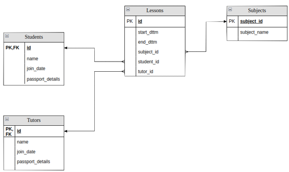

# GoStudent Data Engineering Assignment

This is a compiled version of an assignment

## 1. SQL task

You’re given the data schema:

Write SQL queries to answer the questions:

1. What are the most popular subjects? How many lessons were conducted on these subjects?
   (The most popular subject is the subject on which the maximum number of lessons was conducted.
   Some subjects can have the same number of lessons, we want to see them all in the results in this
   case.)

2. How many hours were spent on lessons each month of this year?

## 2. Python task

Provided:

1) csv file with columns ‘date’, ‘tutor_id’, ‘subject’, ‘cost’
2) csv file tutors_info with columns ‘tutor_id’, ‘tutor_name’, ‘tutor_location’

What we want to get: folders in format ‘YYYY-MM’. Inside of which folder we want to have compressed
parquet files. Every file provides info about one day (name of the file is ‘YYYY-MM-DD’) with
aggregated salary of each tutor per each subject. Columns in the file are:
‘date’, ‘tutor_id’, ‘tutor_name’, ‘tutor_location’, ‘subject’, ‘earned_in_total’. All the null
values in string columns should be replaced with ‘NOT_KNOWN’.

## 3. Case study data engineer recruitment

Your task : Reputation management is very important for GoStudent who aims to build trust between
parents and students on the one hand, and with tutors on the other hand. To this end, we would like
to be able to design a reputation index leveraging social media data. For this assignment, we would
like you to describe the solution you would design for this use case, more specifically :

- How would you retrieve the data from a specific platform -eg twitter-
- What solution would you propose to store the raw information and ensure its availability
- How would you ensure that the data is updated automatically and regularly (e.g. daily) ?
- The Public Relationships department wants to be able to check every day the relevant data in a
  dashboard ; what information would you select and extract from the raw data to expose it in a
  BI/visualization tool? Where and how would you store this information ?
- Bonus question : if you had to derive an overall reputation index that reflects how positively or
  negatively people mention GoStudent on twitter, how would you proceed ?

We expect you to deliver a presentation specifying for each of the previous steps :

- The precise tools you would use (libraries/packages)
- The challenges you expect to face (technical/non-technical),
- What resources you would need (IT or team members).